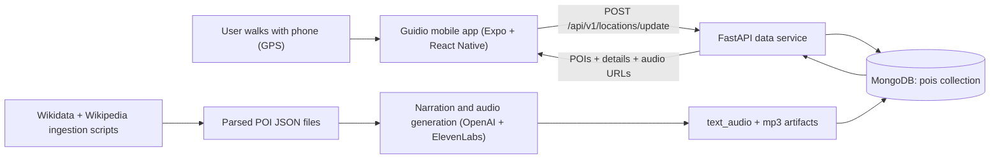

<p align="center">
  
</p>

<h1 align="center">Guidio</h1>
<p align="center"><strong>The city explains itself while you walk.</strong></p>
<p align="center">
  Reactive audio guidance triggered by location, with no fixed routes and no constant Googling.
</p>
<p align="center">
  <a href="https://www.youtube.com/watch?v=hBfTUkYNe68">Watch Demo</a>
</p>


## Inspiration
Last month we landed in a new city with three hours to explore. Instead of enjoying it, we spent almost an hour searching the same things over and over:
- What should we see?
- Is this place important?
- Is it worth walking there?

Then when we reached statues, churches, and hidden landmarks, we still did not know what we were looking at.  
That frustration became a simple idea: **the city should explain itself while you walk**.

## What We Built
Guidio is a reactive audio guide that follows you, not the other way around.

- You move freely through the city.
- As you approach a point of interest, Guidio automatically triggers an audio story.
- Narration is short, contextual, and designed to feel like a real guide beside you.

No rigid tours. No fixed path. No tab switching between maps and search.

## How It Works


### Runtime flow
1. The app gets live GPS coordinates.
2. Backend returns nearby POIs from MongoDB using geospatial queries.
3. App checks proximity continuously and queues nearby POIs by distance.
4. Guidio fetches narration + audio for each POI and plays it automatically.

### Knowledge flow
1. `backend/scripts/parse_all_entities.py` + `wikidata_entity_to_json.py` build POI knowledge from Wikidata/Wikipedia.
2. Categories are inferred by a lightweight local classifier path (Ollama call in script).
3. `backend/ai` generates concise narration text and MP3 audio.
4. `backend/scripts/import_parsed.py` imports everything into MongoDB.

## Tech Stack
- **Mobile:** Expo, React Native, TypeScript, react-native-maps, expo-location, expo-audio
- **Backend:** FastAPI, Uvicorn, Motor (MongoDB async driver), Pydantic
- **Data + AI:** Wikidata/Wikipedia ingestion, OpenAI (LLM), ElevenLabs (TTS), Ollama category classifier in ingestion scripts
- **Database:** MongoDB with `2dsphere` index for near queries

## Quick Start

### 1) Start backend
```bash
cd backend
docker compose up -d --build
```

Load POIs into MongoDB (choose one):

- Full parsed dataset:
```bash
docker compose exec app python scripts/import_parsed.py
```

- Small mock dataset for quick testing:
```bash
docker compose exec app python scripts/seed_db_test_data.py
```

Verify backend:
```bash
curl http://localhost:8000/health
```

API docs: `http://localhost:8000/docs`

### 2) Start frontend
```bash
cd frontend
npm install
SERVER_URL=http://localhost:8000 npm start
```

Notes:
- For a physical device, `SERVER_URL` should be your machine LAN IP, not `localhost`.
- `frontend/config.ts` defaults:
  - `MOCK_DATA = false`
  - `MOCK_GPS = true` (debug joystick enabled)
- Set `MOCK_GPS = false` for real GPS tracking.

## API Overview
Base prefix: `/api/v1/locations`

| Method | Endpoint | Purpose |
|---|---|---|
| `POST` | `/update` | Submit user coordinates and get nearby POIs |
| `GET` | `/detail/{entity_id}` | Get long-form text + narration text + audio metadata |
| `GET` | `/audio/{entity_id}` | Stream MP3 for a POI |
| `GET` | `/by-category/{category}` | Retrieve up to 50 POIs by category |
| `GET` | `/health` | Service health check |

Example:
```bash
curl -X POST http://localhost:8000/api/v1/locations/update \
  -H "Content-Type: application/json" \
  -d '{"latitude": 59.329, "longitude": 18.069, "force": false}'
```

## AI Pipeline (Optional)
The app can run only on pre-generated POI/audio data, but if you want to regenerate narration:

1. Provide keys in `backend/.env`:
   - `OPENAI_API_KEY`
   - `ELEVENLABS_API_KEY`
   - `ELEVENLABS_VOICE_ID` (optional)
   - `LLM_MODEL` (optional, default: `gpt-4o-mini`)
2. Run:
```bash
cd backend
uv sync
uv run python ai/test/test_batch.py -n 10
```
3. Re-import into Mongo:
```bash
uv run python scripts/import_parsed.py
```

## Project Structure
```text
.
├── frontend/                # Expo React Native app
│   ├── components/          # Map, message panel, controls, POI detail modal
│   ├── hooks/               # Tracking, proximity queue, messages
│   └── services/            # API client, bucket index, location helpers
├── backend/
│   ├── app/                 # FastAPI routes, models, Mongo services
│   ├── ai/                  # Narration + TTS generation pipeline
│   ├── scripts/             # Wikidata/Wikipedia ingestion + DB import/cleanup
│   └── docker-compose.yml   # Backend + Mongo local stack
├── guidio_logo.png
├── guidio_usage.png
└── guidio_phrases.png
```

## Challenges
The hardest part was making the experience feel instant and natural.  
We also had to keep narration human and concise, not a trimmed Wikipedia paragraph, while keeping generation and playback fast enough for walking pace.

Most of the engineering tradeoff was here:
- caching aggressively enough for responsiveness
- keeping content fresh and relevant
- preserving narration quality

## What We Learned
The magic is not only AI narration. It is **timing + relevance**.

When audio triggers at the right moment and matches what you are seeing, the experience feels effortless.  
When timing is off, the experience breaks immediately.

That changed how we design the product:
- short stories
- strongest angle first
- adapt to listener context

## What Is Next
- Follow-up voice questions ("tell me more about this place")
- Deeper personalization by interests and pace
- Smoother coverage across more cities

Goal remains the same: **no planning, no limitations, just walk and discover.**
